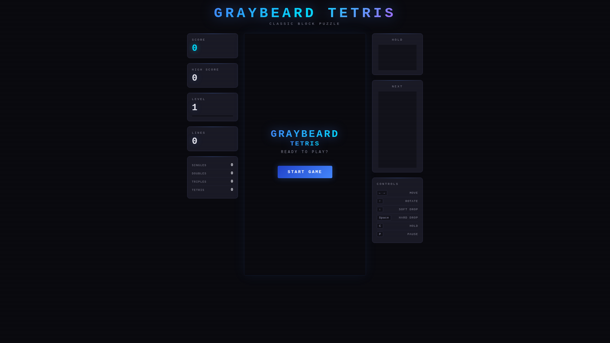

# Tetris Demo

A fully functional Tetris game served by [Bun](https://bun.sh). Dark retro theme with scanline effects, glow rendering, and mobile touch controls.

**[Play it live](https://0xsalt.github.io/tetris-demo/)**

<p align="center">
  
  
</p>

## Features

- **SRS wall kicks** — Standard Rotation System with full kick tables for all pieces including I-piece
- **7-bag randomizer** — Fair piece distribution per official Tetris guidelines
- **Ghost piece** — Preview where the current piece will land
- **Hold piece** — Swap the current piece into hold with `C`
- **Next-3 preview** — See the upcoming three pieces
- **Lock delay** — 500ms lock timer with move reset (max 15 resets)
- **Scoring** — Level progression, line clear stats (singles/doubles/triples/tetris), high score via localStorage
- **Mobile controls** — Touch-friendly buttons on small screens
- **Responsive** — Canvas auto-sizes to fit the viewport

## Quick Start

```bash
git clone https://github.com/0xsalt/tetris-demo.git
cd tetris-demo
bun install
bun start
```

Opens on `http://localhost:3000` (or set `PORT` env var). See [INSTALL.md](INSTALL.md) for systemd service setup and other options.

## Controls

| Key | Action |
|-----|--------|
| Arrow Left/Right | Move |
| Arrow Up | Rotate clockwise |
| Z | Rotate counter-clockwise |
| Arrow Down | Soft drop |
| Space | Hard drop |
| C | Hold |
| P / Esc | Pause |

## Stack

- **Runtime:** Bun
- **Language:** TypeScript
- **Frontend:** Single HTML file with inline CSS/JS, Canvas API rendering
- **Server:** `Bun.serve()` static file server

## License

MIT
